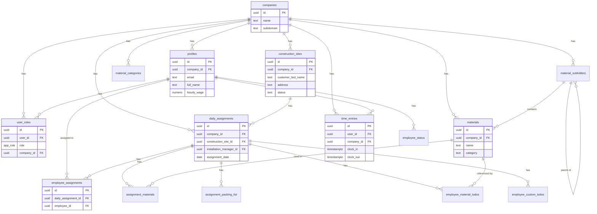

# Werkey - Datenbankdokumentation

Diese Dokumentation beschreibt die vollständige Datenbankstruktur des Werkey Baustellenmanagement-Systems.

## Inhaltsverzeichnis

1. [Übersicht](#übersicht)
2. [Enums (Aufzählungstypen)](#enums-aufzählungstypen)
3. [Tabellen](#tabellen)
4. [Datenbankfunktionen](#datenbankfunktionen)
5. [Entity-Relationship-Diagramm](#entity-relationship-diagramm)
6. [RLS-Policies Übersicht](#rls-policies-übersicht)

---

## Übersicht

**Projekt:** Werkey - Baustellenmanagement-System  
**Technologie:** Supabase (PostgreSQL)  
**Authentifizierung:** Supabase Auth

### Rollenstruktur

| Rolle | Beschreibung |
|-------|--------------|
| `super_admin` | Vollzugriff auf alle Firmen und Daten |
| `accounting` | Buchhaltung - Benutzerverwaltung, Zeiterfassung einsehen |
| `owner` | Firmeninhaber - Lesezugriff auf Firmendaten |
| `installation_manager` | Montageleiter - Einsatzplanung, Baustellen, Materialien |
| `employee` | Mitarbeiter - Eigene Zeiteinträge, zugewiesene Aufgaben |

---

## Enums (Aufzählungstypen)

### app_role

```sql
CREATE TYPE public.app_role AS ENUM (
  'super_admin',
  'accounting',
  'owner',
  'installation_manager',
  'employee'
);
```

### employee_status_type

```sql
CREATE TYPE public.employee_status_type AS ENUM (
  'available',
  'sick',
  'vacation',
  'other'
);
```

---

## Tabellen

### companies

**Beschreibung:** Speichert Firmendaten und Subdomains für Multi-Tenant-Betrieb.

| Spalte | Typ | Nullable | Default | Beschreibung |
|--------|-----|----------|---------|--------------|
| `id` | uuid | Nein | `gen_random_uuid()` | Primärschlüssel |
| `name` | text | Nein | - | Firmenname |
| `subdomain` | text | Ja | - | Subdomain für Firmenzugang |
| `created_at` | timestamptz | Nein | `now()` | Erstellungszeitpunkt |
| `updated_at` | timestamptz | Nein | `now()` | Letztes Update |

**RLS-Policies:**
- Jeder kann Firmen über Subdomain lesen
- Super Admins können alle Firmen sehen und erstellen
- Benutzer können ihre eigene Firma sehen

---

### profiles

**Beschreibung:** Benutzerprofile mit zusätzlichen Informationen wie Stundenlohn.

| Spalte | Typ | Nullable | Default | Beschreibung |
|--------|-----|----------|---------|--------------|
| `id` | uuid | Nein | - | Primärschlüssel (ref: auth.users) |
| `company_id` | uuid | Ja | - | Zugehörige Firma |
| `email` | text | Nein | - | E-Mail-Adresse |
| `full_name` | text | Ja | - | Vollständiger Name |
| `phone_number` | text | Ja | - | Telefonnummer |
| `hourly_wage` | numeric | Ja | NULL | Stundenlohn |
| `calculated_hourly_wage` | numeric | Ja | - | Berechneter Stundenlohn |
| `created_at` | timestamptz | Nein | `now()` | Erstellungszeitpunkt |
| `updated_at` | timestamptz | Nein | `now()` | Letztes Update |

**RLS-Policies:**
- Benutzer können ihr eigenes Profil einfügen und sehen
- Benutzer können Profile ihrer Firma sehen
- Accounting kann Profile ihrer Firma sehen, einfügen und aktualisieren
- Super Admins können alle Profile sehen

---

### user_roles

**Beschreibung:** Rollenzuweisungen für Benutzer (RBAC).

| Spalte | Typ | Nullable | Default | Beschreibung |
|--------|-----|----------|---------|--------------|
| `id` | uuid | Nein | `gen_random_uuid()` | Primärschlüssel |
| `user_id` | uuid | Nein | - | Benutzer-ID |
| `role` | app_role | Nein | - | Zugewiesene Rolle |
| `company_id` | uuid | Nein | - | Zugehörige Firma |
| `created_at` | timestamptz | Nein | `now()` | Erstellungszeitpunkt |

**RLS-Policies:**
- Benutzer können ihre eigenen Rollen sehen
- Accounting kann Rollen ihrer Firma sehen und erstellen (außer super_admin/accounting)
- Installation Managers können Rollen ihrer Firma sehen
- Super Admins können alle Rollen sehen und erstellen

---

### construction_sites

**Beschreibung:** Baustellen mit Kundendaten und Status.

| Spalte | Typ | Nullable | Default | Beschreibung |
|--------|-----|----------|---------|--------------|
| `id` | uuid | Nein | `gen_random_uuid()` | Primärschlüssel |
| `company_id` | uuid | Nein | - | Zugehörige Firma |
| `created_by` | uuid | Ja | - | Ersteller (Montageleiter) |
| `customer_last_name` | text | Nein | - | Nachname des Kunden |
| `address` | text | Ja | - | Adresse der Baustelle |
| `customer_phone` | text | Ja | - | Telefonnummer des Kunden |
| `color` | varchar | Ja | - | Farbcode für Darstellung |
| `status` | text | Nein | `'active'` | Status: active/archived |
| `notes` | text | Ja | - | Notizen zur Baustelle |
| `start_date` | date | Ja | - | Startdatum |
| `end_date` | date | Ja | - | Enddatum |
| `created_at` | timestamptz | Nein | `now()` | Erstellungszeitpunkt |
| `updated_at` | timestamptz | Nein | `now()` | Letztes Update |

**RLS-Policies:**
- Installation Managers können Baustellen ihrer Firma sehen, erstellen, aktualisieren und löschen
- Mitarbeiter können zugewiesene Baustellen sehen
- Accounting und Owner können Firmen-Baustellen sehen
- Owner kann Baustellen aktualisieren und löschen
- Super Admins können alle Baustellen sehen

---

### daily_assignments

**Beschreibung:** Tägliche Einsatzplanungen für Baustellen.

| Spalte | Typ | Nullable | Default | Beschreibung |
|--------|-----|----------|---------|--------------|
| `id` | uuid | Nein | `gen_random_uuid()` | Primärschlüssel |
| `company_id` | uuid | Nein | - | Zugehörige Firma |
| `construction_site_id` | uuid | Nein | - | Zugewiesene Baustelle |
| `installation_manager_id` | uuid | Nein | - | Verantwortlicher Montageleiter |
| `assignment_date` | date | Nein | - | Einsatzdatum |
| `start_time` | time | Ja | `'08:00:00'` | Startzeit |
| `end_time` | time | Ja | `'17:00:00'` | Endzeit |
| `notes` | text | Ja | - | Notizen zum Einsatz |
| `created_at` | timestamptz | Nein | `now()` | Erstellungszeitpunkt |
| `updated_at` | timestamptz | Nein | `now()` | Letztes Update |

**RLS-Policies:**
- Installation Managers können ihre eigenen Einsätze erstellen, sehen, aktualisieren und löschen
- Installation Managers können alle Firmen-Einsätze sehen
- Mitarbeiter können zugewiesene Einsätze sehen
- Accounting und Owner können Firmen-Einsätze sehen

---

### employee_assignments

**Beschreibung:** Verknüpfung von Mitarbeitern zu täglichen Einsätzen.

| Spalte | Typ | Nullable | Default | Beschreibung |
|--------|-----|----------|---------|--------------|
| `id` | uuid | Nein | `gen_random_uuid()` | Primärschlüssel |
| `daily_assignment_id` | uuid | Nein | - | Zugehöriger Einsatz |
| `employee_id` | uuid | Nein | - | Zugewiesener Mitarbeiter |
| `created_at` | timestamptz | Nein | `now()` | Erstellungszeitpunkt |

**RLS-Policies:**
- Mitarbeiter können Team-Zuweisungen sehen
- Installation Managers können Zuweisungen ihrer Einsätze erstellen, sehen und löschen

---

### employee_status

**Beschreibung:** Verfügbarkeitsstatus der Mitarbeiter pro Tag.

| Spalte | Typ | Nullable | Default | Beschreibung |
|--------|-----|----------|---------|--------------|
| `id` | uuid | Nein | `gen_random_uuid()` | Primärschlüssel |
| `employee_id` | uuid | Nein | - | Mitarbeiter-ID |
| `status_date` | date | Nein | - | Datum |
| `status` | employee_status_type | Nein | `'available'` | Status |
| `created_at` | timestamptz | Nein | `now()` | Erstellungszeitpunkt |
| `updated_at` | timestamptz | Nein | `now()` | Letztes Update |

**Statuswerte:**
- `available` - Verfügbar
- `sick` - Krank
- `vacation` - Urlaub
- `other` - Sonstiges

**RLS-Policies:**
- Mitarbeiter können ihren eigenen Status verwalten
- Accounting und Installation Managers können Status der Firma sehen

---

### time_entries

**Beschreibung:** Zeiterfassung (Ein-/Ausstempeln).

| Spalte | Typ | Nullable | Default | Beschreibung |
|--------|-----|----------|---------|--------------|
| `id` | uuid | Nein | `gen_random_uuid()` | Primärschlüssel |
| `user_id` | uuid | Nein | - | Benutzer-ID |
| `company_id` | uuid | Nein | - | Zugehörige Firma |
| `clock_in` | timestamptz | Nein | `now()` | Einstempelzeit |
| `clock_out` | timestamptz | Ja | - | Ausstempelzeit |
| `created_at` | timestamptz | Nein | `now()` | Erstellungszeitpunkt |
| `updated_at` | timestamptz | Nein | `now()` | Letztes Update |

**RLS-Policies:**
- Benutzer können eigene Zeiteinträge einfügen, aktualisieren und sehen
- Accounting kann Firmen-Zeiteinträge sehen
- Super Admins können alle Zeiteinträge sehen

---

### materials

**Beschreibung:** Materialliste pro Firma.

| Spalte | Typ | Nullable | Default | Beschreibung |
|--------|-----|----------|---------|--------------|
| `id` | uuid | Nein | `gen_random_uuid()` | Primärschlüssel |
| `company_id` | uuid | Nein | - | Zugehörige Firma |
| `created_by` | uuid | Ja | - | Ersteller |
| `name` | text | Nein | - | Materialname |
| `category` | text | Nein | - | Kategorie |
| `subfolder_id` | uuid | Ja | - | Unterordner |
| `is_limited` | boolean | Nein | `false` | Begrenzte Verfügbarkeit |
| `created_at` | timestamptz | Nein | `now()` | Erstellungszeitpunkt |
| `updated_at` | timestamptz | Nein | `now()` | Letztes Update |

**RLS-Policies:**
- Mitarbeiter können Materialien ihrer Firma sehen
- Installation Managers können Materialien verwalten

---

### material_categories

**Beschreibung:** Kategorien für Materialien mit Konfigurationsoptionen.

| Spalte | Typ | Nullable | Default | Beschreibung |
|--------|-----|----------|---------|--------------|
| `id` | uuid | Nein | `gen_random_uuid()` | Primärschlüssel |
| `company_id` | uuid | Nein | - | Zugehörige Firma |
| `created_by` | uuid | Ja | - | Ersteller |
| `name` | text | Nein | - | Kategoriename |
| `icon` | text | Ja | `'package'` | Icon-Name |
| `display_order` | integer | Ja | `100` | Anzeigereihenfolge |
| `is_limited` | boolean | Ja | `false` | Begrenzte Verfügbarkeit |
| `sort_numeric` | boolean | Ja | `false` | Numerische Sortierung |
| `requires_quantity` | boolean | Ja | `false` | Mengenangabe erforderlich |
| `created_at` | timestamptz | Ja | `now()` | Erstellungszeitpunkt |
| `updated_at` | timestamptz | Ja | `now()` | Letztes Update |

**RLS-Policies:**
- Installation Managers können Kategorien verwalten

---

### material_subfolders

**Beschreibung:** Unterordner für hierarchische Materialorganisation.

| Spalte | Typ | Nullable | Default | Beschreibung |
|--------|-----|----------|---------|--------------|
| `id` | uuid | Nein | `gen_random_uuid()` | Primärschlüssel |
| `company_id` | uuid | Nein | - | Zugehörige Firma |
| `created_by` | uuid | Ja | - | Ersteller |
| `name` | text | Nein | - | Ordnername |
| `parent_category` | text | Nein | - | Übergeordnete Kategorie |
| `parent_subfolder_id` | uuid | Ja | - | Übergeordneter Unterordner |
| `created_at` | timestamptz | Nein | `now()` | Erstellungszeitpunkt |
| `updated_at` | timestamptz | Nein | `now()` | Letztes Update |

**RLS-Policies:**
- Installation Managers können Unterordner verwalten

---

### assignment_materials

**Beschreibung:** Materialien, die einem täglichen Einsatz zugewiesen sind.

| Spalte | Typ | Nullable | Default | Beschreibung |
|--------|-----|----------|---------|--------------|
| `id` | uuid | Nein | `gen_random_uuid()` | Primärschlüssel |
| `daily_assignment_id` | uuid | Nein | - | Zugehöriger Einsatz |
| `material_id` | uuid | Nein | - | Zugewiesenes Material |
| `quantity` | integer | Ja | `1` | Menge |
| `created_at` | timestamptz | Nein | `now()` | Erstellungszeitpunkt |

**RLS-Policies:**
- Mitarbeiter können Materialien ihrer Einsätze sehen
- Installation Managers können Materialien verwalten

---

### assignment_packing_list

**Beschreibung:** Packliste für Einsätze mit Abhak-Funktion.

| Spalte | Typ | Nullable | Default | Beschreibung |
|--------|-----|----------|---------|--------------|
| `id` | uuid | Nein | `gen_random_uuid()` | Primärschlüssel |
| `daily_assignment_id` | uuid | Nein | - | Zugehöriger Einsatz |
| `employee_id` | uuid | Ja | - | Zugewiesener Mitarbeiter |
| `text` | text | Nein | - | Packlisten-Eintrag |
| `is_checked` | boolean | Ja | `false` | Abgehakt |
| `created_at` | timestamptz | Ja | `now()` | Erstellungszeitpunkt |
| `updated_at` | timestamptz | Ja | `now()` | Letztes Update |

**RLS-Policies:**
- Mitarbeiter können Packlisten ihrer Einsätze sehen und abhaken
- Installation Managers können Packlisten verwalten

---

### employee_material_todos

**Beschreibung:** Material-Aufgaben für einzelne Mitarbeiter.

| Spalte | Typ | Nullable | Default | Beschreibung |
|--------|-----|----------|---------|--------------|
| `id` | uuid | Nein | `gen_random_uuid()` | Primärschlüssel |
| `daily_assignment_id` | uuid | Nein | - | Zugehöriger Einsatz |
| `employee_id` | uuid | Nein | - | Zugewiesener Mitarbeiter |
| `assignment_material_id` | uuid | Nein | - | Zugewiesenes Material |
| `quantity` | integer | Ja | `1` | Menge |
| `is_completed` | boolean | Ja | `false` | Erledigt |
| `completed_at` | timestamptz | Ja | - | Erledigungszeitpunkt |
| `notes` | text | Ja | - | Notizen |
| `created_at` | timestamptz | Ja | `now()` | Erstellungszeitpunkt |
| `updated_at` | timestamptz | Ja | `now()` | Letztes Update |

**RLS-Policies:**
- Mitarbeiter können ihre Aufgaben sehen und aktualisieren
- Mitarbeiter können alle Aufgaben ihrer zugewiesenen Baustellen sehen
- Installation Managers können Aufgaben verwalten

---

### employee_custom_todos

**Beschreibung:** Benutzerdefinierte Aufgaben für Mitarbeiter.

| Spalte | Typ | Nullable | Default | Beschreibung |
|--------|-----|----------|---------|--------------|
| `id` | uuid | Nein | `gen_random_uuid()` | Primärschlüssel |
| `daily_assignment_id` | uuid | Nein | - | Zugehöriger Einsatz |
| `employee_id` | uuid | Ja | - | Zugewiesener Mitarbeiter |
| `text` | text | Nein | - | Aufgabentext |
| `is_completed` | boolean | Ja | `false` | Erledigt |
| `completed_at` | timestamptz | Ja | - | Erledigungszeitpunkt |
| `created_at` | timestamptz | Ja | `now()` | Erstellungszeitpunkt |
| `updated_at` | timestamptz | Ja | `now()` | Letztes Update |

**RLS-Policies:**
- Mitarbeiter können ihre Aufgaben sehen und aktualisieren
- Installation Managers können Aufgaben verwalten

---

## Datenbankfunktionen

### has_role

Prüft, ob ein Benutzer eine bestimmte Rolle hat.

```sql
CREATE OR REPLACE FUNCTION public.has_role(_user_id UUID, _role app_role)
RETURNS BOOLEAN
LANGUAGE SQL
STABLE
SECURITY DEFINER
SET search_path = public
AS $$
  SELECT EXISTS (
    SELECT 1
    FROM public.user_roles
    WHERE user_id = _user_id
      AND role = _role
  )
$$;
```

### get_user_company_id

Gibt die Firmen-ID eines Benutzers zurück.

```sql
CREATE OR REPLACE FUNCTION public.get_user_company_id(_user_id UUID)
RETURNS UUID
LANGUAGE SQL
STABLE
SECURITY DEFINER
SET search_path = public
AS $$
  SELECT company_id
  FROM public.profiles
  WHERE id = _user_id
  LIMIT 1
$$;
```

### get_company_by_subdomain

Findet eine Firma anhand ihrer Subdomain.

```sql
CREATE OR REPLACE FUNCTION public.get_company_by_subdomain(_subdomain TEXT)
RETURNS UUID
LANGUAGE SQL
STABLE
SECURITY DEFINER
SET search_path = public
AS $$
  SELECT id
  FROM public.companies
  WHERE subdomain = _subdomain
  LIMIT 1
$$;
```

### validate_user_subdomain

Validiert, ob ein Benutzer Zugriff auf eine bestimmte Subdomain hat.

```sql
CREATE OR REPLACE FUNCTION public.validate_user_subdomain(_user_id UUID, _subdomain TEXT)
RETURNS BOOLEAN
LANGUAGE SQL
STABLE
SECURITY DEFINER
SET search_path = public
AS $$
  SELECT EXISTS (
    SELECT 1
    FROM public.profiles p
    JOIN public.companies c ON p.company_id = c.id
    WHERE p.id = _user_id
      AND c.subdomain = _subdomain
  )
$$;
```

### is_employee_assigned_to_daily_assignment

Prüft, ob ein Mitarbeiter einem täglichen Einsatz zugewiesen ist.

```sql
CREATE OR REPLACE FUNCTION public.is_employee_assigned_to_daily_assignment(_user_id UUID, _assignment_id UUID)
RETURNS BOOLEAN
LANGUAGE SQL
STABLE
SECURITY DEFINER
SET search_path = public
AS $$
  SELECT EXISTS (
    SELECT 1
    FROM public.employee_assignments
    WHERE employee_id = _user_id
      AND daily_assignment_id = _assignment_id
  )
$$;
```

### update_updated_at_column

Trigger-Funktion zur automatischen Aktualisierung der `updated_at` Spalte.

```sql
CREATE OR REPLACE FUNCTION public.update_updated_at_column()
RETURNS TRIGGER AS $$
BEGIN
  NEW.updated_at = now();
  RETURN NEW;
END;
$$ LANGUAGE plpgsql SET search_path = public;
```

### handle_new_user

Trigger-Funktion, die bei neuen Benutzern ein Profil erstellt.

```sql
CREATE OR REPLACE FUNCTION public.handle_new_user()
RETURNS TRIGGER AS $$
BEGIN
  INSERT INTO public.profiles (id, email, full_name)
  VALUES (
    NEW.id,
    NEW.email,
    COALESCE(NEW.raw_user_meta_data->>'full_name', '')
  );
  RETURN NEW;
END;
$$ LANGUAGE plpgsql SECURITY DEFINER SET search_path = public;
```

### enforce_single_active_time_entry

Trigger-Funktion, die sicherstellt, dass nur ein aktiver Zeiteintrag pro Benutzer existiert.

```sql
CREATE OR REPLACE FUNCTION public.enforce_single_active_time_entry()
RETURNS TRIGGER AS $$
BEGIN
  IF NEW.clock_out IS NULL THEN
    IF EXISTS (
      SELECT 1 FROM public.time_entries
      WHERE user_id = NEW.user_id
        AND clock_out IS NULL
        AND id != COALESCE(NEW.id, '00000000-0000-0000-0000-000000000000'::uuid)
    ) THEN
      RAISE EXCEPTION 'User already has an active time entry';
    END IF;
  END IF;
  RETURN NEW;
END;
$$ LANGUAGE plpgsql SET search_path = public;
```

---

## Entity-Relationship-Diagramm



---

## RLS-Policies Übersicht

### Zugriffsrechte nach Rolle

| Rolle | Lesen | Erstellen | Aktualisieren | Löschen |
|-------|-------|-----------|---------------|---------|
| **super_admin** | Alles | Alles | Alles | Alles |
| **accounting** | Firmen-Daten, Profile, Zeiteinträge | Profile, Rollen | Profile | - |
| **owner** | Firmen-Daten, Baustellen, Einsätze | - | Baustellen | Baustellen |
| **installation_manager** | Firmen-Baustellen, Materialien, Einsätze | Baustellen, Einsätze, Materialien | Eigene Baustellen/Einsätze | Eigene Baustellen/Einsätze |
| **employee** | Zugewiesene Baustellen/Einsätze, eigene Zeiteinträge | Eigene Zeiteinträge | Eigene Aufgaben/Zeiteinträge | - |

### Wichtige Sicherheitskonzepte

1. **SECURITY DEFINER Funktionen**: Funktionen wie `has_role()` werden mit erhöhten Rechten ausgeführt, um RLS-Rekursion zu vermeiden.

2. **Firmen-Isolation**: Alle Daten sind durch `company_id` getrennt. Benutzer können nur Daten ihrer eigenen Firma sehen.

3. **Subdomain-Validierung**: Bei der Anmeldung wird geprüft, ob der Benutzer Zugriff auf die aktuelle Subdomain hat.

4. **Hierarchische Zugriffskontrolle**: Installation Managers können nur ihre eigenen Einsätze verwalten, aber alle Einsätze der Firma sehen.

---

## Setup-Anleitung

### 1. Neue Supabase-Instanz einrichten

1. Erstellen Sie ein neues Supabase-Projekt
2. Führen Sie die Migrationen in der Reihenfolge aus (siehe `supabase/migrations/`)

### 2. Erste Benutzer anlegen

Nutzen Sie die Edge Function `setup-initial-user` um den ersten Accounting-Benutzer zu erstellen:

```bash
curl -X POST https://your-project.supabase.co/functions/v1/setup-initial-user \
  -H "Content-Type: application/json" \
  -d '{"subdomain": "ihre-firma"}'
```

### 3. Umgebungsvariablen

Erforderliche Umgebungsvariablen:
- `VITE_SUPABASE_URL` - Supabase Projekt-URL
- `VITE_SUPABASE_PUBLISHABLE_KEY` - Supabase Anon Key
- `INITIAL_ADMIN_PASSWORD` - Passwort für den initialen Admin

---

*Letzte Aktualisierung: Januar 2026*
